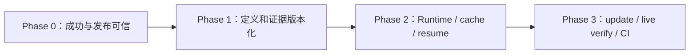

# Living User Manual Architecture Optimization Implementation Plan

> **For Claude:** REQUIRED SUB-SKILL: Use superpowers:executing-plans to implement this plan task-by-task.
> **其他执行器：** 使用当前环境的 executing-plans 技能，按任务 ID 执行；本文件的创建仅代表计划已编写，不代表已经获得执行代码修改、业务写操作或发布的授权。

**Goal:** 将现有 Living User Manual 改造成证据可信、状态可恢复、缓存可解释、更新范围可追踪的用户手册维护工具。

**Architecture:** 保留 Node/CommonJS CLI、文件存储和 Playwright，逐步统一 Evidence Pipeline，拆分 UserTask 定义与 RuntimeTask 执行。采用单进程、有界 DAG 和文件持久化 Runtime，Run 内复用 Browser、Scenario 间隔离 Context；暂不引入数据库、队列或常驻 Agent 服务。

**Tech Stack:** Node.js、CommonJS、js-yaml、Playwright/Chromium、Node assert 与现有自定义测试 runner；图像后处理拟采用 sharp，Markdown 结构解析拟采用支持 CommonJS 的 markdown-it。新增依赖的确切版本、Node 引擎和平台支持须在 P0-08 中核实并固定 lockfile。

---

## 1. 文档状态与阅读顺序

- 日期：2026-09-24。
- 状态：待实施；本轮仅编写文档。
- 基线：当前工作区的实际代码，而非仅 HEAD；已有 README.md、SKILL.md、docs/ARCHITECTURE.md、test/compat-aliases.test.js 修改和 preserved-from-neoagent-worktree-2026-09-18/，均不由本计划覆盖。
- 当前 package.json 为 0.1.0；update 未实现，verify 只做离线任务产物检查。
- 本计划中的新文件、新命令、新 schema 都是目标设计，不代表当前可调用。
- 路径均相对于仓库根目录 E:/NeoStar/user-manual，除非明确写为业务项目产物路径。

| 何时阅读 | 文档 |
|---|---|
| 开始前、阶段切换时 | 本总计划 |
| 修改 schema、状态、路径、缓存、错误或接口时 | [数据与接口契约](2026-09-24-living-manual-contracts.md) |
| 每次选择任务、记录进度时 | [统一 TODO 清单](2026-09-24-living-manual-todo.md) |
| 修复当前可信度和发布问题 | [Phase 0](2026-09-24-living-manual-phase-0.md) |
| 构建版本化领域模型和证据存储 | [Phase 1](2026-09-24-living-manual-phase-1.md) |
| 构建 Runtime、缓存和恢复机制 | [Phase 2](2026-09-24-living-manual-phase-2.md) |
| 实现增量更新、在线验证和 CI | [Phase 3](2026-09-24-living-manual-phase-3.md) |

执行进度只在 TODO 文档维护。各阶段文档中的操作步骤是规范，不另维护完成状态。接口以 contracts 为准；若实施需要改接口，应先修改契约、列出受影响任务，再改实现。

## 2. 需要纠正的当前行为

| 编号 | 当前代码事实 | 影响 | 负责任务 |
|---|---|---|---|
| A01 | config/schema.js 默认页面 rawDir 在 docs；generate.js 未走 publication 校验 | public 发布绕过脱敏 | P0-02、P0-06 |
| A02 | task-draft.js 写项目根相对图片路径；verify.js 按项目根检查 | Markdown 实际解析与校验不一致 | P0-01 |
| A03 | capture 的 waitFor 超时为 warning；executor 不验证入口 HTTP 和 stateBefore | 错页面或错误状态可被标成功 | P0-03 |
| A04 | completion.verification 来自任务定义 | 完成声明没有对应验证证据 | P0-04、P1-08 |
| A05 | finalize 先写文档再 transition；task 状态只单向推进 | 失败后文件已变、stale 无恢复入口 | P0-05、P1-03 |
| A06 | 截图、manifest 固定名字覆盖；facts 无输入版本绑定 | 新旧产物混用 | P1-01、P1-02、P1-07 |
| A07 | mergePage 只比路径；route 是身份；隐式依赖未建模 | 同文件修改和路由迁移漏判 | P1-03、P1-05 |
| A08 | 全量写 pages，索引没有 revision，writeText 非原子 | 并发丢更新、部分写入 | P0-05、P1-06 |
| A09 | raw/sanitized/annotated 是三次截屏；after 标注使用动作前矩形 | 图像与矩形时间不一致 | P0-06 |
| A10 | auth.enabled 未接线；status ready 只代表文件可读 | 匿名场景带登录态、会话失效误判 | P0-07 |
| A11 | Playwright 优先搜个人目录；依赖未固定 | 安装和 CI 不可复现 | P0-08 |
| A12 | 无持久 Run、任务重试、恢复和 Capture cache | 跨命令靠 Agent 协调、重复执行成本高 | Phase 2 |
| A13 | update 未实现、verify 不访问浏览器 | Living Manual 闭环缺失 | P3-01～P3-04 |

证据阅读入口：src/commands/capture.js、src/commands/capture-task.js、src/tasks/executor.js、src/tasks/model.js、src/generate/task-draft.js、src/commands/generate-task.js、src/commands/verify.js、src/privacy/publication.js、src/inspect/model.js、src/auth/runtime.js。

## 3. 已做出的架构决策

1. 保留 Node/CommonJS，使用 JSDoc 和运行时 schema；不以语言迁移作为前置条件。
2. 文件存储继续作为第一版持久化实现；写入由 Project Store、Capture Store、Run Store 管理，命令不再各自拼路径写文件。
3. 项目事实、不可变证据、执行状态、日志、可丢弃缓存分别保存。
4. Page ID 稳定；Route 是地址绑定；Scenario 表达身份、数据、入口和检查点；UserTask 表达用户目标；ManualSection 表达文档组织。
5. 发布图像由同一份 raw 派生；annotated 目录名不再作为“已安全处理”的充分证明。
6. 事实以 claimId 关联 assertionId 和 Capture；源码推断保持 inferred，不能因同页截过图就整体升级为 verified。
7. schemaVersion、definition revision、sourceFingerprint、tool version、renderer version 分开管理。
8. Browser 在单 Run/worker 内复用；Context 按 Scenario 和身份隔离；不建设跨 CLI daemon。
9. Planner 为确定性依赖规划器；模型只参与语义分析、候选任务和可约束文案。
10. Snapshot/Run 保存输入修订；恢复前重新确认输入，不能把旧输入的已完成任务当新输入成功。
11. 对写操作不承诺 exactly-once；结果不明时记录 outcome_unknown，并先查业务后置条件。
12. 首期只支持单进程串行执行；受控并发作为 Phase 3 验收后的优化，账户隔离优先于速度。

## 4. 目标目录与模块职责

```text
src/
  commands/                 # 参数、输出、调用应用用例
  config/                   # 配置读取、校验、兼容
  inspect/                  # 扫描、源码关系和索引派生
  tasks/                    # 用户任务定义、候选、审批
  scenarios/                # 场景、检查点、数据配置
  model/                    # schema/revision/claim 公共领域约束
  store/                    # 模型快照、锁、提交与迁移
  browser/                  # Browser/Context 生命周期、定位与动作
  auth/                     # 用户级认证快照、身份验证和刷新
  evidence/                 # Capture 记录、断言、图像派生和完整性
  privacy/                  # 隐私检测、规则与发布门槛
  generate/                 # facts、草稿、结构化文案和最终渲染
  publication/              # 发布准备、journal、release 对账
  runtime/                  # DAG、Run、任务执行、恢复和错误策略
  cache/                    # fingerprint、lookup 和失效解释
  update/                   # Git changes、impact 与局部更新
  verify/                   # artifact/live/visual 验证
```

这些目录按任务需要渐进创建，不在第一天建立空骨架。模块之间的实现可以共享内部函数，不为每个步骤建立一层空 Adapter。

业务项目产物：

```text
.manual/
  config.yaml
  project.yaml
  pages/ scenarios/ tasks/ manuals/    # 可审阅的领域定义
  captures/<captureId>.json            # 不可变去敏证据元数据
  releases/<releaseId>.json            # 不可变发布关联
  current.json                        # 当前已提交模型及发布引用
  snapshots/<modelRevision>/          # 提交的模型快照，供断点恢复
  index/                              # 按 revision 可重建
  cache/                              # 可丢弃查找与分析缓存
  drafts/<runId>/                      # facts、润色输入输出
  runs/<runId>/                       # plan、task 状态、events、staging
  artifacts/raw/ sanitized/ diagnostics/
  migrations/<migrationId>/           # 迁移 manifest、备份与进度
docs/manual/
  pages/ 或兼容旧的 <pageId>.md
  tasks/<taskId>.md
  images/annotated/<artifactHash>.png
```

继续保留现有 annotatedDir 配置作为发布资源根，以减少 URL 迁移；文件名逐步改成内容 hash。系统用户级 auth 缓存继续在项目外，按 project/environment/profile 隔离。

## 5. 实施顺序和阶段门槛



| 阶段 | 交付内容 | 退出门槛 |
|---|---|---|
| Phase 0 | 当前命令的关键错误修复；统一发布门槛；浏览器依赖可复现 | 错页不成功、raw 不公开、文档链接有效、非法 finalize 不改文件 |
| Phase 1 | 稳定模型、不可变 Capture、revision、迁移和发布 journal | 重跑合法、旧产物可追溯、内容修改可识别、中断可对账 |
| Phase 2 | 文件持久化 Runtime、DAG、Browser 复用、缓存和 resume | generate 自动补足依赖；新进程恢复；模型失败不重复截图 |
| Phase 3 | Git impact、update、live verify、Fixture、编辑保护和 CI | 定向更新、可检测运行态漂移、人工修改不静默丢失 |

每阶段完成后执行阶段文档末尾的集成验收；通过之前不将新行为设为下一阶段的默认依赖。可发布小版本，但旧实现退出必须有兼容测试和迁移说明。

## 6. 每项任务的执行协议

1. 读取该任务的 Files 和前置依赖，确认当前代码未因其他变更失配。
2. 每个行为先加一个失败用例；执行指定测试，确认失败原因是行为缺失，而不是环境问题。
3. 按任务列出的算法实现，必要时把大步骤拆成 2～5 分钟的函数级工作项。
4. 运行该模块测试及所列相关回归；阶段结束再运行 npm test。
5. 对新 CLI 参数补 help/JSON 契约；新增测试文件登记到 test/run.js。
6. 记录命令、结果和限制；没有运行过的验收不记通过。
7. 实施阶段按任务形成可审阅提交；只 stage 当前任务文件，保护已有用户修改。提交命名遵循项目提交格式。
8. 更新 TODO 的任务状态和验收记录；有剩余失败不能勾选完成。

本次只编写计划，不执行上述步骤。计划文件中的命令是未来实施指令，不是已运行记录。

## 7. 统一测试策略

- 延续 node test/<file>.test.js 的方式，避免为此重写所有测试。
- 纯模块测试覆盖路径、状态转换、hash、失效决策和计划构建。
- 注入 fs、clock、随机 ID、Browser factory，验证失败后的可见行为。
- 浏览器夹具使用本地 HTTP 服务和专用认证缓存，禁止使用用户真实业务账号跑自动回归。
- 恢复测试用独立子进程及故障注入点；模拟 kill 后重新启动，不只调用同一内存对象的 resume。
- 图像测试比较导出的实际 PNG 像素与矩形覆盖；不只检查 CSS 字符串。
- Markdown 图片按文档目录解析；实际渲染 smoke test 与存在性检查共同使用。
- 缓存测试断言 Browser 启动/导航/截图调用数和命中理由，不写“elapsed < 100ms”一类脆弱阈值。
- 性能在相同 fixture、浏览器版本及机器上比较冷/热路径，输出分阶段耗时。

## 8. 兼容与回滚约定

- 新 schema 先提供 reader/migrator，再切换 writer；未知更高版本明确拒绝。
- 默认迁移 dry-run；apply 记录输入 hash、备份、映射和 journal；重复 apply 不重复创建 ID。
- 历史 verified 只转为 legacy observation，缺少的验证范围为 unknown。
- 保留的真实项目快照先复制到临时测试目录再迁移，测试不修改原始保留目录。
- Phase 0 页面 public 旧原图应阻止继续发布并给出重采集建议；这是一项明确的安全行为变更，不能为了兼容继续绕过。
- 新版本发布前保留上一 release；失败后恢复引用，不覆盖已提交的不可变 Capture。
- 项目模型 v2 生效时 config.version 同步提升到 2，让旧 CLI 的既有版本检查实际拒绝写入；新 CLI 继续读取旧 v1 配置。回滚程序版本时恢复整份迁移前快照，不混用新旧 writer。

## 9. 非目标与延后事项

- 不把此次工作扩展为所有前端框架自动扫描；非 Next 项目先支持显式页面/路由导入。
- 不实现通用数据库 Fixture 平台、生产数据写入自动化、验证码绕过。
- 不实现分布式队列、云 Browser 服务、多 Agent 自主协同。
- 不承诺任何网页都可像素完全一致，也不承诺 DOM 检测能识别所有隐私内容。
- 不靠 LLM 评分替代硬性事实、状态和产物校验。
- 不删除旧文档、原图或用户修改；清理必须在引用分析和明确执行范围内进行。

## 10. 最终完成定义

在干净测试项目中：init → generate → 重复 generate 命中缓存 → 修改共享组件 → update 局部重建 → verify --live 检测运行态漂移；任意指定检查点中断后能由新进程恢复。输出 Markdown 图片有效、发布资产通过隐私检查、每条 verified claim 可追溯到断言、旧 Capture 保留。以上流程在 Windows 与至少一种 Linux CI 环境通过。
